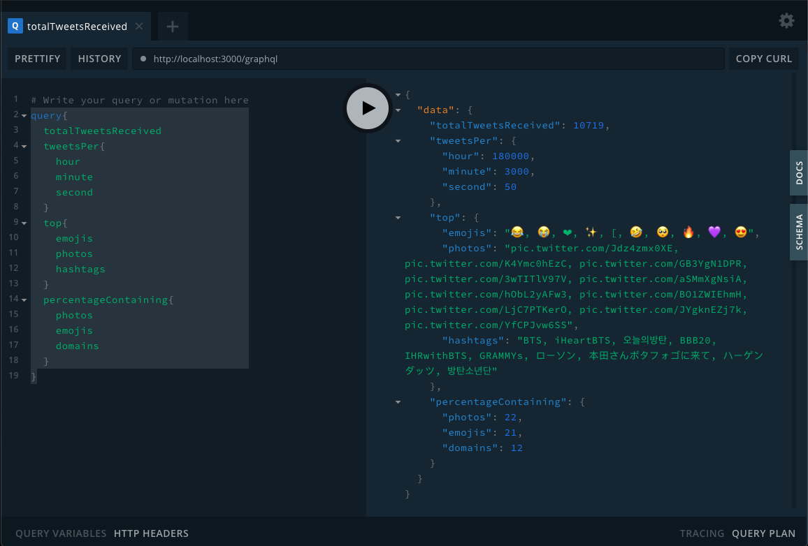

# Twitter API Graphql Toy
Accepts a stream of Tweets and runs various simple metrics on them. These metrics can be consume via the GraphQL playground

## Getting Started
1. Clone this repository
2. Add your Twitter API keys and rename `sample.env` to `.env`
3. Install and run
```
npm install
npm start
```
4. Go to GraphQL playground in browser at `http://localhost:3000/graphql`
5. Try this example query in the playground
  
```
query{
  totalTweetsReceived
  tweetsPer{
    hour
    minute
    second
  }
  top{
    emojis
    photos
    hashtags
  }
  percentageContaining{
    photos
    emojis
    domains
  }
}
```

You should get output that looks something like this:



The nature of GraphQL definitions makes their queries and options self-documenting, to see the various query requirements and options, simply click `Docs`, drill down to the desired data point and modify the query accordingly

## Technologies Used
- Node
- GraphQL / Apollo Server
- Mocha
- Twitter API and client wrapper
